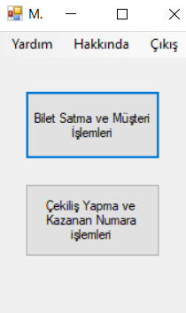
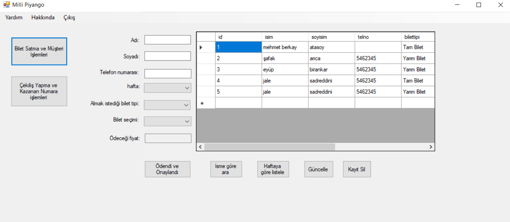
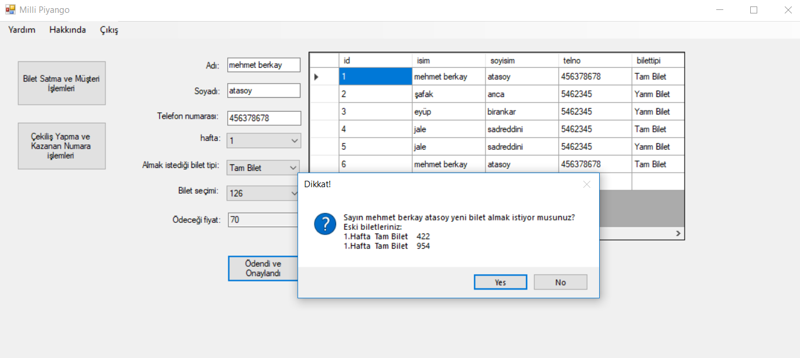
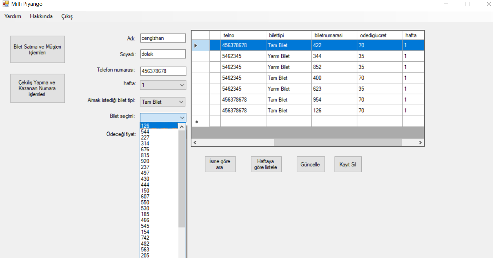
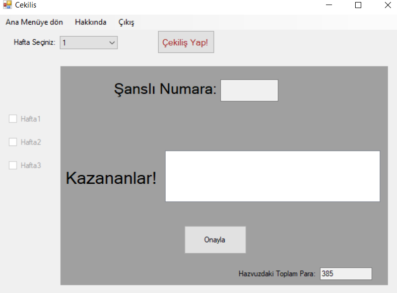
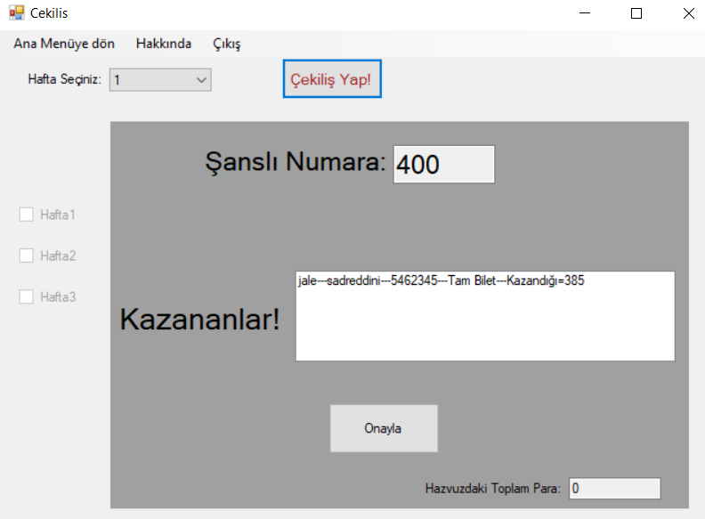

# Milli Piyango
Milli piyango, bir otomasyon uygulamasıdır. Bu uygulamada temsili olarak, 3 rakamlı rastgele piyango biletleri oluşturulmuştur. Bilet tipine göre alacakları ücretler belirlenmiştir.

## Uygulamadan Görüntüler
 

Açılış ekranı
 

Bilet satış ve müşteri işlemleri
 

Bilet satış ve müşteri işlemleri
 

Bilet satış ve müşteri işlemleri
 

Çekiliş ekranı
 

Çekiliş ekranı
 

